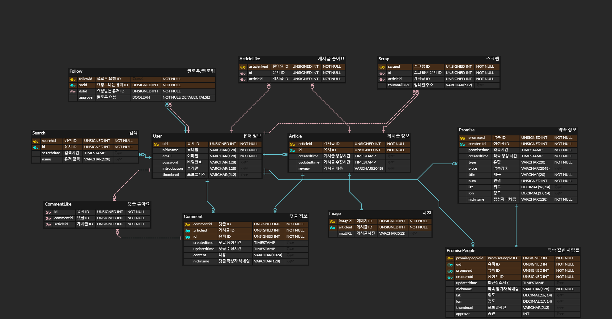

# Pipl

<p>
      은 의 줄임말로, SNS 상에서 모임/약속을 쉽게 잡아주는 소셜 플랫폼입니다.
</p>

<br>

<br>

     

<br>

**Pipl 개발 페이지** &#10140;  [](https://www.notion.so/472849a205114733b53d218219d4b8a7) [](https://jira.ssafy.com/secure/RapidBoard.jspa?rapidView=9717&projectKey=S05P13B302&selectedIssue=S05P13B302-32) [](https://www.figma.com/file/GzAF1xAtlr1X2IS0iNzggx?embed_host=notion&kind=&node-id=0%3A1&viewer=1)

<br>

**Pipl 개발자**

  팀장 정종우 jongs3030@naver.com

  팀원 김백준 henry9489@gmail.com

  팀원 신형식 shs950930@gmail.com

  팀원 이두호 dhdev5ba@gmail.com

  팀원 정지홍 jjh1731@naver.com

<br>

<br>

### 목차

- [프로젝트 소개](#프로젝트-소개)
- [프로젝트 명세](#프로젝트-명세)
  - [배포 환경](#배포-환경)
  - [개발 환경](#개발-환경)
  - [Design Resources](#design-resources)
  - [핵심 라이브러리](#핵심-라이브러리)
- [브랜치 전략](#브랜치-전략)
- [컨벤션 규칙](#컨벤션-규칙)
- [ERD](#erd)
- [SWAGGER](#swagger)
- [개발현황](#개발현황)

<br>

### 프로젝트 소개

Pipl 은 SNS 상에서 모임/약속을 쉽게 잡아주는 소셜 플랫폼입니다.

모임/약속을 잡는 가장 첫 단추인, 사람들에게 말하는 과정을 Pipl 을 이용하여 **손쉽게 전달**할 수 있습니다.

팔로우/팔로워와 태그 기반으로, 잡고자 하는 약속을 특정 사람들에게 알릴 수 있습니다.

약속을 잡는데 성공하면, 사용자 GPS 정보 사용 동의 하에 약속 1시간 전부터 약속 대상자들의 위치를 확인할 수 있습니다.

<br>

### 프로젝트 명세

#### 배포 환경

<p align="center">
    
</p>

<br>

- **URL** : http://i5b302.p.ssafy.io/
- **배포 여부** : O
- **접속 가능** : O
- **HTTPS 적용** : X
- **PORT** : Vue (3000), Spring-Boot (8080)
- **배포 방식**
  - 현재 배포 테스트 상황입니다. (Frontend, Backend 연결 확인)
  - 추후 CI/CD 를 구축하여 애자일 방식으로

<br>

#### 개발 환경

##### Front-end

- **Framework** : Vue.js (2.6)
- **지원 환경** : Mobile Web
- **담당자** : 신형식, 이두호, 정종우
  - 신형식 : 회원정보(로그인, 회원가입, 비밀번호 변경), 게시글(조회, 생성, 수정), 댓글, 약속 리스트, 약속 생성
  - 이두호 : 헤더(네비게이션, 라우팅 관리), 검색, 알림, 스크랩, 약속 상세페이지
  - 정종우 : 프로필(조회, 수정), 팔로우/팔로워, 스크랩, 약속 인원 위치 공유 페이지

<br>

##### Back-end

- **Framework** : Spring boot (2.2)
- **Database** : MySQL
- **담당자** : 김백준, 정지홍
  - 공통 : 게시글, 약속
  - 김백준 : 회원정보(JWT 인증), 검색, 알림
  - 정지홍 : 팔로우/팔로워, 댓글, 스크랩

<br>

##### Design

- **Framework 사용** : O
  - [Bootstrap-Vue](https://bootstrap-vue.org/)
- **Design Tool 사용** : X
- **담당자** : 신형식, 이두호, 정종우

<br>

#### Design Resources

**외부 템플릿 또는 에셋** (이미지 또는 링크 첨부)

<br>

**자체 제작 산출물** (필요시 이미지 또는 설명 첨부)

- LOGO

<p align="center">
     
</p>

<br>

### 핵심 라이브러리

<br>

### 브랜치 전략

 &#10140;  기능단위 개발이 진행되는 브랜치입니다. (feature/frontend/기능 &#8644;  feature/backend/기능)

 &#10140;  기능단위 개발이 완료된 개발 관련 브랜치입니다.

 &#10140;  배포전 버전 관리를 위한 브랜치입니다.

 &#10140;  배포된 메인 브랜치입니다.

<br>

### 컨벤션 규칙

##### Commit 컨벤션

> `Feat:`, `Fix:`, `Design:`, `Docs:`, `Rename:`, `Remove:`, `Comment:`

```bash
$ git commit -m "Feat: Make Login Page
> 로그인 페이지 구현했습니다."

$ git commit -m "Fix: Edit User JWT
> 로그인 시 사용되는 JWT 관리 방식을 OOO 에서 OOO 로 수정했습니다."
```

<br>

Commit 메세지는 중요 사항을 간결하게 작성하는 것을 규칙으로 삼았습니다.

<br>

### ERD



<br>

<br>

<br>

### SWAGGER

> 노션 SWAGGER &#10140;  [Here](https://www.notion.so/SWAGGER-6c59eedd1def4d37b52969b0b17bd27c)

<br>

| REST API                             | Method | 설명                                                                                                                                                                          | 현황 |
| ------------------------------------ | :----: | ----------------------------------------------------------------------------------------------------------------------------------------------------------------------------- | :--: |
| account/checkJWT                     |  GET   | 로그인 후 반환 받은 Token을 사용하여 회원정보를 체크합니다.<br />**(Need Token)**                                                                                             | Done |
| account/login                        |  GET   | 로그인을 합니다.                                                                                                                                                              | Done |
| account/signup                       |  POST  | 회원가입을 합니다.                                                                                                                                                            | Done |
| account/profile                      | DELETE | 회원 탈퇴를 합니다.<br />**(Need Token)**                                                                                                                                     | Done |
| account/profile                      |  PUT   | 유저 닉네임을 수정합니다.<br />**(Need Token)**                                                                                                                               | Done |
|                                      |        |                                                                                                                                                                               |      |
| account/profile/{nickname}/follower  |  GET   | 해당 유저의 팔로우 리스트를 반환합니다.                                                                                                                                       | Done |
| account/profile/{nickname}/following |  GET   | 해당 유저의 팔로잉 리스트를 반환합니다.                                                                                                                                       | Done |
| account/profile/follow               |  POST  | 다른 유저에게 팔로우 요청합니다.                                                                                                                                              | Done |
| account/profile/follow               | DELETE | 팔로우 요청을 거부한다.                                                                                                                                                       | Done |
| account/profile/follow               |  PUT   | 팔로우 요청을 승인한다.                                                                                                                                                       | Done |
| account/changePassword               |  PUT   | 본인의 비밀번호를 변경합니다.<br />**(Need Token)**                                                                                                                           | Done |
|                                      |        |                                                                                                                                                                               |      |
| article/                             |  GET   | 메인페이지(피드: 최신 글 순)를 반환합니다.                                                                                                                                    | Done |
| article/                             |  GET   | 유저의 전체 게시글 정보(간략)를 반환합니다.<br />**(Need Token)**                                                                                                             |      |
| article/                             |  POST  | 해당 유저의 새로운 게시글을 생성합니다.<br />**(Need Token)**                                                                                                                 |      |
| article/{nickname}                   |  GET   | 해당 유저의 프로필 정보, 팔로잉 유무, 피드 정보를 얻어옵니다.                                                                                                                 |      |
| article/{articleid}                  |  GET   | 해당 유저의 특정 게시글의 상세정보(좋아요 수, 댓글 수 포함)를 반환합니다.                                                                                                     | Done |
| article/{articleid}                  |  PUT   | 해당 유저의 특정 게시글의 정보를 수정합니다.<br />**(Need Token)**                                                                                                            |      |
| article/{articleid}                  | DELETE | 해당 유저의 특정 게시글을 삭제합니다.<br />**(Need Token)**                                                                                                                   | Done |
| article/{articleid}/like             |  POST  | 해당 유저의 특정 게시글을 좋아요 요청을 보냅니다.                                                                                                                             | Done |
| article/{articleid}/like             | DELETE | 해당 유저의 특정 게시글을 좋아요 취소 요청을 보냅니다.                                                                                                                        | Done |
| article/{articleid}/comment          |  GET   | 해당 유저의 특정 게시글의 댓글 리스트 정보를 반환합니다.                                                                                                                      | Done |
| article/{articleid}/comment          |  POST  | 해당 유저의 특정 게시글에 댓글을 작성합니다.<br />**(Need Token)**                                                                                                            | Done |
| article/comment/{commentid}          |  PUT   | 해당 유저의 특정 게시글 속 특정 댓글을 수정합니다.<br />**(Need Token)**                                                                                                      | Done |
| article/comment/{commentid}          | DELETE | 해당 유저의 특정 게시글 속 특정 댓글을 삭제합니다.<br />**(Need Token)**                                                                                                      | Done |
|                                      |        |                                                                                                                                                                               |      |
| search/                              |  GET   | (검색어와 유사한 or 이미 검색했던) 유저 닉네임을 검색합니다                                                                                                                   | Done |
| search/                              |  POST  | (최근 검색, 검색한 결과 정보를 얻기 위해) 검색한 값을 DB에 저장합니다.                                                                                                        | Done |
|                                      |        |                                                                                                                                                                               |      |
| alarm/                               |  GET   | 1. 다른 사용자가 내 게시글에 단 댓글 정보를 최신순 ???개로 반환합니다.<br />2. 팔로우 요청 리스트를 반환합니다.                                                               |      |
| alarm/{nickname}                     | DELETE | Follow DB 상에서 해당 팔로우 요청을 삭제합니다.                                                                                                                               |      |
| alarm/{nickname}                     |  POST  | Follow DB 상에서 해당 팔로우 요청을 수락(False → True) 합니다.                                                                                                                |      |
|                                      |        |                                                                                                                                                                               |      |
| scrap/                               |  GET   | 본인이 스크랩한 게시글 리스트를 반환합니다.<br />**(Need Token)**                                                                                                             | Done |
| scrap/{articleid}                    |  POST  | 해당 게시글을 본인의 스크랩 리스트에 추가합니다.<br />**(Need Token)**                                                                                                        | Done |
| scrap/{scrapid}                      | DELETE | 스크랩한 해당 게시글을 삭제합니다.<br />**(Need Token)**                                                                                                                      | Done |
|                                      |        |                                                                                                                                                                               |      |
| promise/                             |  GET   | 악속 목록을 보여줍니다.<br /><br />대기중인 약속: 본인이 생성하였지만, 약속 시간 전이면서 인원이 다 차지 않은 약속<br />다가오는 약속: 내가 참가한 약속<br />**(Need Token)** |      |
| promise/                             |  POST  | 약속을 생성합니다.<br />**(Need Token)**                                                                                                                                      |      |
| promise/{promiseid}                  | DELETE | 약속에 불참합니다.<br />**(Need Token)**                                                                                                                                      |      |
| promise/{promiseid}                  |  GET   | 특정 약속 정보를 가져옵니다.<br />**(Need Token)**                                                                                                                            |      |
| promise/people/{promiseid}           | DELETE | 약속에 불참합니다.<br />**(Need Token)**                                                                                                                                      |      |
| promise/people/{promiseid}           |  POST  | 약속에 참가합니다.<br />**(Need Token)**                                                                                                                                      |      |
| promise/people/{promiseid}           |  PUT   | 특정 약속 참가자의 위도 경도를 업데이트합니다.<br />**(Need Token)**                                                                                                          |      |
| promise/people/{promiseid}           |  GET   | 약속 참가자들의 최근위치, 목적지 정보를 가져옵니다.<br />**(Need Token)**                                                                                                     |      |

<br>

### 개발현황

#### 온보딩

<p align="center">
    
</p>

<br>

사용자들에게 피플이 무엇인가에 대해서 친숙하게 전달하고자, 첫 화면에 온보딩을 두었습니다.

<br>

#### 회원가입/로그인

<p align="center">
    
</p>

<br>

고유한 닉네임, 이메일을 가지도록 **중복확인 기능**을 추가하였습니다.

닉네임, 이메일 그리고 비밀번호가 일차적으로 Frontend 에서 유효성 검사를 통해 통과시에만 가입하기 버튼이 활성화됩니다.

로그인 사용자만 이용할 수 있는 SNS 서비스이기 때문에, 로그인하여 vuex 및 localStorage 에 저장되는 token 이 없으면 Login 페이지로 이동합니다.

<br>

#### 프로필/수정

<p align="center">
    
</p>


<br>

Vue 의 Route.js 에서 Parameter 에 nickname 을 담아 보내, 해당 정보로 프로필을 렌더링합니다.

프로필 정보 수정 페이지에서 닉네임과 본인 소개글 및 프로필 이미지를 수정할 수 있습니다.

<br>

#### 알림/요청


<br>

제 글에 좋아요가 눌리면 Like 탭에, 팔로우 신청이 오면 Follow 탭에, 그리고 약속 초대가 오면 Promise 탭에 기록이 생깁니다.

<br>

#### 유저 검색


<br>

검색 페이지 방문 시, 혹은 검색창이 비어있을 경우 최근 검색 기록을 보여줍니다.

검색 시 해당 단어가 포함된 결과를 보여줍니다.

<br>

#### 피드


<br>

#### 게시글 생성


<br>

#### 다크모드


<br>

다크모드와 밝은모드 두 개의 버전으로 이용할 수 있도록 구현했습니다.

<br>

#### 약속생성


<br>

약속을 생성하는 기능입니다. 

<br>

#### 약속 상세조회/지금어디


<br>

약속을 생성하는 기능입니다. 

<br>

<br>

# 운영

## 운영에 필요한 정보

1. aws ec2 server
2. nginx
3. SSL 인증서(Certbot)
4. maria-db
5. java
6. folder path

<br>

1. aws-ec2 서버를 사용하여 배포를 진행.

username : ubuntu

<br>

2. nginx

```bash
sudo certbot --nginx -d example.com$ sudo apt-get update
sudo apt-get upgrade
sudo apt-get install nginx

#/etc/nginx/site-available/default 파일을 변경하여 port와 SSL 설정을 해줌

===============현재 설정===========

server {
#       listen 80 default_server;
#       listen [::]:80 default_server;
#       return 301 https://i5b302.p.ssafy.io$request_uri;

        # SSL configuration
        #
        listen 443 ssl;
        server_name i5b302.p.ssafy.io www.i5b302.p.ssafy.io;
        ssl_certificate /etc/letsencrypt/live/i5b302.p.ssafy.io/fullchain.pem;

        ssl_certificate_key /etc/letsencrypt/live/i5b302.p.ssafy.io/privkey.pem;
        # listen [::]:443 ssl default_server;
        root /home/ubuntu/b302/dist;

        # Add index.php to the list if you are using PHP
#       index index.html index.htm index.nginx-debian.html;
        index index.html index.htm;

#       server_name _;
#       server_name i5b302.p.ssafy.io www.i5b302.p.ssafy.io;

        location / {
                # First attempt to serve request as file, then
                # as directory, then fall back to displaying a 404.
        #       try_files $uri $uri/ =404;
                try_files $uri $uri/ /index.html;
        }

        location /api {
                proxy_pass http://localhost:8080/api;
                proxy_redirect off;
                charset utf-8;

                proxy_set_header X-Real-IP $remote_addr;
                proxy_set_header X-Forwarded-For $proxy_add_x_forwarded_for;
                proxy_set_header X-Forwarded-Proto $scheme;
                proxy_set_header X-NginX-Proxy true;
        }

}

server {
        listen 80 default_server;
        listen [::]:80 default_server;
        return 301 https://i5b302.p.ssafy.io$request_uri;

}
server {
				root /home/ubuntu/b302/dist;

        # Add index.php to the list if you are using PHP
#       index index.html index.htm index.nginx-debian.html;
        index index.html index.htm;

#       server_name _;
		    server_name i5b302.p.ssafy.io; # managed by Certbot

        location / {
                # First attempt to serve request as file, then
                # as directory, then fall back to displaying a 404.
        #       try_files $uri $uri/ =404;
                try_files $uri $uri/ /index.html;
        }

        location /api {
                proxy_pass http://localhost:8080/api;
                proxy_redirect off;
                charset utf-8;

                proxy_set_header X-Real-IP $remote_addr;
                proxy_set_header X-Forwarded-For $proxy_add_x_forwarded_for;
                proxy_set_header X-Forwarded-Proto $scheme;
                proxy_set_header X-NginX-Proxy true;
        }
			listen [::]:443 ssl ipv6only=on; # managed by Certbot
	    listen 443 ssl; # managed by Certbot
	    ssl_certificate /etc/letsencrypt/live/i5b302.p.ssafy.io/fullchain.pem; # managed by Certbot
	    ssl_certificate_key /etc/letsencrypt/live/i5b302.p.ssafy.io/privkey.pem; # managed by Certbot
	    include /etc/letsencrypt/options-ssl-nginx.conf; # managed by Certbot
	    ssl_dhparam /etc/letsencrypt/ssl-dhparams.pem; # managed by Certbot

}
server {
	    if ($host = i5b302.p.ssafy.io) {
	        return 301 https://$host$request_uri;
	    } # managed by Certbot


	        listen 80 ;
	        listen [::]:80 ;
	    server_name i5b302.p.ssafy.io;
	    return 404; # managed by Certbot

}
                                                                                                                      205,0-1       Bot
```

<br>

3. CertBot(SSL)

- Firebase Alarm(FCM), KakaoMap, Social Login을 사용하려면 Https 요청이 필요.
- CertBot을 사용하여 무료 SSL(Let's Encrypt) 인증서를 발급받고 서버에 적용

```bash
sudo add-apt-repository ppa:certbot/certbot
sudo apt install python-certbot-nginx
sudo certbot --nginx -d i5b302.p.ssafy.io
# https://i5b302.p.ssafy.io 로 접속하기 위해서

#SSL 자동갱신 등록 (90일)
sudo certbot renew --dry-run

#If 수동 갱신하려면
sudo certbot renew
```

<br>

4. Maria-db(Docker)

- Docker를 사용하여 MariaDB 설치(Docker설치는 따로 설명하지 않음)

```bash
$ docker run --name maria-db -p 3306:3306 -e MYSQL_ROOT_PASSWORD=ssafy -d mariadb
$ docker exec -it maria-db mysql -u root -p
# 실행 후 비밀번호란에 위에 설정해준 비밀번호 입력
# root 계정으로 로그인한 상태이므로 새로운 계정 생성.
# "ssafy" 이름으로 계정 생성
# Database 계정생성은 설명하지 않음

$ docker exec -it maria-db mysql -u ssafy -p
#로그인 후 sql-query.txt 내용 적용
MariaDB [(none)]> show databases;
# "commonpjt" table이 보이면 성공
```

<br>

5. java

- 설치

```bash
# install the necessary dependencies
sudo apt-get -q update
sudo apt-get -yq install gnupg curl

# add Azul's public key
sudo apt-key adv \
  --keyserver hkp://keyserver.ubuntu.com:80 \
  --recv-keys 0xB1998361219BD9C9

# download and install the package that adds
# the Azul APT repository to the list of sources
curl -O https://cdn.azul.com/zulu/bin/zulu-repo_1.0.0-2_all.deb

# install the package
sudo apt-get install ./zulu-repo_1.0.0-2_all.deb

# update the package sources
sudo apt-get update

# install zulu-8
apt-get install zulu-8
```

- 환경변수 등록

```bash
> vi /etc/profile

...

export JAVA_HOME=/usr/lib/jvm/zulu-8-amd64

...
```

<br>

6. Folder Path

- 기존 nginx dist 경로는 "/var/www/dist/html" , nginx설정을 /home/ubuntu/b302/~ 로 해놓았기 때문에 "/home/ubuntu/ 폴더안에 b302 폴더를 생성

<br>

## 배포하는 방법

1. 수동배포(준비물)

- dist폴더
- .jar file

---

[https://lab.ssafy.com/s05-webmobile2-sub3/S05P13B302](https://lab.ssafy.com/s05-webmobile2-sub3/S05P13B302) 경로의 "master" branch clone 후

```bash
#frontend Folder
> yarn install
> yarn run build

#backend Folder
> mvn package

# dist 폴더와 jar 파일을 ec-2 AWS server "/home/ubuntu/b302/" 경로에 Copy

#AWS server (Location : "/home/ubuntu/b302/")
sudo service nginx start
sudo java -jar webcuration-0.0.1-SNAPSHOT.jar
```

2. Docker Jenkins를 통해서 CICD구축

```bash
docker run -d -u root -p 5000:8080 --name=jenkins jenkins/jenkins
#5000포트로 오픈
docker logs jenkins
# 패스워드 확인 후 설치

```

- Nodejs, Gitlab, Publish over SSH 등 필요한 요소 설치
- Global Tool Configuration 에서 maven과 nodejs 경로를 설정해줌.
  참고로 jenkins docker 내부에 maven과 nodejs를 설치해야함

```bash
apt update
apt install maven
# mvn -v 으로 버전확인 가능
apt install nodejs
apt install npm
# nodejs -v 으로 버전확인가능
```

- System Configuration에서 Gitlab Token을 받아와 연동
- Pipeline 생성 (key값 gitlab webhook과 연동. push branch "release"로 설정)

- pipeline shell script 배포용

```bash
pipeline {    agent any        tools {        jdk "java"        maven "mvn"        nodejs "nodejs"    }    stages{        stage("clone"){            steps{                cleanWs()                echo "Clone SSAFY Gitlab"                git branch : 'release', changelog: false, credentialsId: 'henry9489',  poll: false, url: "https://lab.ssafy.com/s05-webmobile2-sub3/S05P13B302"            }            post{                success{                    echo "Clone Success"                }            }        }        stage('build'){            steps{                dir('frontend'){                    echo "Build FrontEnd Vue.js"                    sh "npm install"                    sh "npm run build"                    sh "tar -cvzf dist.tar dist deploy.sh killboot.sh"            }                dir('backend'){                        echo "Build BackEnd SpringBoot"                        sh "mvn package"                        sh "mv /var/jenkins_home/workspace/aws_pipe/backend/target/webcuration-0.0.1-SNAPSHOT.jar /var/jenkins_home/workspace/aws_pipe/frontend"                }            }        }        stage('dist transfer') {            steps([$class: 'BapSshPromotionPublisherPlugin']) {                dir("frontend"){                sshPublisher(                    continueOnError: false, failOnError: true,                    publishers: [                        sshPublisherDesc(                            configName: "aws_pipe",//Jenkins 시스템 정보에 사전 입력한 서버 ID                            verbose: true,                            transfers: [                                sshTransfer(execCommand : "rm -rf /home/ubuntu/b302/webcuration-0.0.1-SNAPSHOT.jar;sleep 1"),                                sshTransfer(execCommand : "rm -rf /home/ubuntu/b302/dist.tar;sleep 1"),                                sshTransfer(                                    sourceFiles: "**/*.tar", //전송할 파일                                    removePrefix: "", //파일에서 삭제할 경로가 있다면 작성                                    remoteDirectory: "/", //배포할 위치                                    execCommand: "tar -xvf /home/ubuntu/b302/dist.tar -C /home/ubuntu/b302/" //원격지에서 실행할 커맨드                                ),                                sshTransfer(execCommand : "sudo service nginx restart"),                                sshTransfer(execCommand : "sleep 3")                            ]                        )                    ]                )            }        }            post{                success{                    echo "finish frontend"                }            }        }        stage('jar transfer') {            steps([$class: 'BapSshPromotionPublisherPlugin']) {                dir("frontend"){                    sshPublisher(                        continueOnError: false, failOnError: true,                        publishers: [                            sshPublisherDesc(                                configName: "aws_pipe",                                verbose: true,                                transfers: [                                    sshTransfer(                                        sourceFiles: "**/*.jar",                                        removePrefix: "",                                        remoteDirectory: "/",                                        execCommand: "sudo chmod 744 /home/ubuntu/b302/killboot.sh"                                    ),                                    sshTransfer(execCommand : "sh /home/ubuntu/b302/killboot.sh;")                                ]                            )                        ]                    )                }        }        post{            success{                echo "backend finish"            }        }    }        stage('restart server') {            steps([$class: 'BapSshPromotionPublisherPlugin']) {                sshPublisher(                    continueOnError: false, failOnError: true,                    publishers: [                        sshPublisherDesc(                            configName: "aws_pipe",//Jenkins 시스템 정보에 사전 입력한 서버 ID                            verbose: true,                            transfers: [																		sshTransfer(execCommand: "sudo chmod 744 /home/ubuntu/b302/deploy.sh"),                                    sshTransfer(execCommand:"sh /home/ubuntu/b302/deploy.sh")		                                sshTransfer(execCommand:"ps -ef | grep java")                                // sshTransfer(execCommand:"sudo rm /home/ubuntu/b302/deploy.sh")                            ]                        )                    ]                )        }        post{            success{                echo "CICD Finish"            }        }    }    }}
```

## 발생할 수 있는 오류

- 접속 후 아무행동없이 5시간이 지났을 때 Token만료 오류 발생 가능성 → 로그아웃 후 재로그인
- 알람이 foreground 상태에서 안옵니다! → 정상입니다. background 상태일 때만 알람이 나타납니다.
- 약속 목록을 보는데 지도가 오류가 나서 안나옵니다! → 지도 우측상단에 새로고침 버튼 클릭

