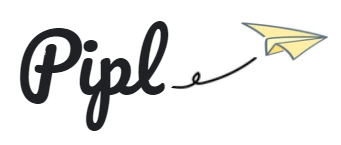
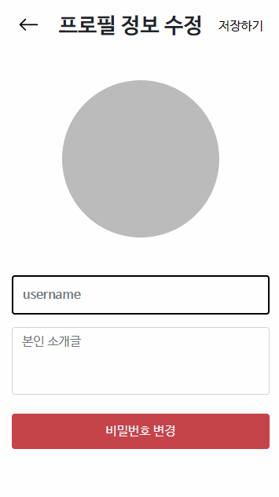

# Pipl

<p>
      은 의 줄임말로, SNS 상에서 모임/약속을 쉽게 잡아주는 소셜 플랫폼입니다.
</p>

<br>

<br>

      

<br>

**Pipl 개발 페이지**  &#10140;    [](https://www.notion.so/472849a205114733b53d218219d4b8a7)    [](https://jira.ssafy.com/secure/RapidBoard.jspa?rapidView=9717&projectKey=S05P13B302&selectedIssue=S05P13B302-32)    [](https://www.figma.com/file/GzAF1xAtlr1X2IS0iNzggx?embed_host=notion&kind=&node-id=0%3A1&viewer=1)

<br>

**Pipl 개발자**

​	  팀장    정종우    jongs3030@naver.com

​	  팀원    김백준    henry9489@gmail.com

​	  팀원    신형식    shs950930@gmail.com

​	  팀원    이두호    dhdev5ba@gmail.com

​	  팀원    정지홍    jjh1731@naver.com

<br>

<br>

### 목차

- [프로젝트 소개](#프로젝트-소개)   
- [프로젝트 명세](#프로젝트-명세)
  - [배포 환경](#배포-환경)
  - [개발 환경](#개발-환경)
  - [Design Resources](#design-resources)
  - [핵심 라이브러리](#핵심-라이브러리)
- [브랜치 전략](#브랜치%20전략)
- [컨벤션 규칙](#컨벤션%20규칙)
- [ERD](#erd)
- [SWAGGER](#swagger)
- [개발현황](#개발현황)


<br>

### 프로젝트 소개
Pipl 은 SNS 상에서 모임/약속을 쉽게 잡아주는 소셜 플랫폼입니다.

모임/약속을 잡는 가장 첫 단추인, 사람들에게 말하는 과정을 Pipl 을 이용하여 **손쉽게 전달**할 수 있습니다.

팔로우/팔로워와 태그 기반으로, 잡고자 하는 약속을 특정 사람들에게 알릴 수 있습니다.

약속을 잡는데 성공하면, 사용자 GPS 정보 사용 동의 하에 약속 1시간 전부터 약속 대상자들의 위치를 확인할 수 있습니다. 

<br>

### 프로젝트 명세
#### 배포 환경

<p align="center">
    
</p>

<br>

- __URL__ : http://i5b302.p.ssafy.io/
- __배포 여부__ : O
- __접속 가능__ : O
- __HTTPS 적용__ : X
- __PORT__ : Vue (3000), Spring-Boot (8080)
- **배포 방식**
  - 현재 배포 테스트 상황입니다. (Frontend, Backend 연결 확인)
  - 추후 CI/CD 를 구축하여 애자일 방식으로

<br>

#### 개발 환경
##### Front-end
- __Framework__ : Vue.js (2.6)
- __지원 환경__ : Mobile Web
- __담당자__ : 신형식, 이두호, 정종우
  - 신형식 : 회원정보(로그인, 회원가입, 비밀번호 변경), 게시글(조회, 생성, 수정), 댓글, 약속 리스트, 약속 생성
  - 이두호 : 헤더(네비게이션, 라우팅 관리), 검색, 알림, 스크랩, 약속 상세페이지
  - 정종우 : 프로필(조회, 수정), 팔로우/팔로워, 스크랩, 약속 인원 위치 공유 페이지

<br>

##### Back-end
- __Framework__ : Spring boot (2.2)
- __Database__ : MySQL
- __담당자__ : 김백준, 정지홍
  - 공통 : 게시글, 약속
  - 김백준 : 회원정보(JWT 인증), 검색, 알림
  - 정지홍 : 팔로우/팔로워, 댓글, 스크랩

<br>

##### Design
- __Framework 사용__ : O
  - [Bootstrap-Vue](https://bootstrap-vue.org/)
- __Design Tool 사용__ : X
- __담당자__ : 신형식, 이두호, 정종우

<br>

#### Design Resources
__외부 템플릿 또는 에셋__ (이미지 또는 링크 첨부)

<br>

__자체 제작 산출물__ (필요시 이미지 또는 설명 첨부)
- LOGO


<p align="center">
     
</p>

<br>

### 핵심 라이브러리

<br>

### 브랜치 전략

  &#10140;  기능단위 개발이 진행되는 브랜치입니다. (feature/frontend/기능  &#8644;  feature/backend/기능)

  &#10140;  기능단위 개발이 완료된 개발 관련 브랜치입니다.

  &#10140;  배포전 버전 관리를 위한 브랜치입니다.

 &#10140;  배포된 메인 브랜치입니다.

<br>

### 컨벤션 규칙

##### Commit 컨벤션

> `Feat:`, `Fix:`, `Design:`, `Docs:`, `Rename:`, `Remove:`, `Comment:`

```bash
$ git commit -m "Feat: Make Login Page
> 로그인 페이지 구현했습니다."

$ git commit -m "Fix: Edit User JWT
> 로그인 시 사용되는 JWT 관리 방식을 OOO 에서 OOO 로 수정했습니다."
```

<br>

Commit 메세지는 중요 사항을 간결하게 작성하는 것을 규칙으로 삼았습니다.

<br>

### ERD


<br>

<br>

<br>

### SWAGGER

> 노션 SWAGGER  &#10140;  [Here](https://www.notion.so/SWAGGER-6c59eedd1def4d37b52969b0b17bd27c)

<br>

| REST API                             | Method | 설명                                                         | 현황 |
| ------------------------------------ | :----: | ------------------------------------------------------------ | :--: |
| account/checkJWT                     |  GET   | 로그인 후 반환 받은 Token을 사용하여 회원정보를 체크합니다.<br />**(Need Token)** | Done |
| account/login                        |  GET   | 로그인을 합니다.                                             | Done |
| account/signup                       |  POST  | 회원가입을 합니다.                                           | Done |
| account/profile                      | DELETE | 회원 탈퇴를 합니다.<br />**(Need Token)**                    | Done |
| account/profile                      |  PUT   | 유저 닉네임을 수정합니다.<br />**(Need Token)**              | Done |
|                                      |        |                                                              |      |
| account/profile/{nickname}/follower  |  GET   | 해당 유저의 팔로우 리스트를 반환합니다.                      | Done |
| account/profile/{nickname}/following |  GET   | 해당 유저의  팔로잉  리스트를 반환합니다.                    | Done |
| account/profile/follow               |  POST  | 다른 유저에게 팔로우 요청합니다.                             | Done |
| account/profile/follow               | DELETE | 팔로우 요청을 거부한다.                                      | Done |
| account/profile/follow               |  PUT   | 팔로우 요청을 승인한다.                                      | Done |
| account/changePassword               |  PUT   | 본인의 비밀번호를 변경합니다.<br />**(Need Token)**          | Done |
|                                      |        |                                                              |      |
| article/                             |  GET   | 메인페이지(피드: 최신 글 순)를 반환합니다.                   | Done |
| article/                             |  GET   | 유저의 전체 게시글 정보(간략)를 반환합니다.<br />**(Need Token)** |      |
| article/                             |  POST  | 해당 유저의 새로운 게시글을 생성합니다.<br />**(Need Token)** |      |
| article/{nickname}                   |  GET   | 해당 유저의 프로필 정보, 팔로잉 유무, 피드 정보를 얻어옵니다. |      |
| article/{articleid}                  |  GET   | 해당 유저의 특정 게시글의 상세정보(좋아요 수, 댓글 수 포함)를 반환합니다. | Done |
| article/{articleid}                  |  PUT   | 해당 유저의 특정 게시글의 정보를 수정합니다.<br />**(Need Token)** |      |
| article/{articleid}                  | DELETE | 해당 유저의 특정 게시글을 삭제합니다.<br />**(Need Token)**  | Done |
| article/{articleid}/like             |  POST  | 해당 유저의 특정 게시글을 좋아요 요청을 보냅니다.            | Done |
| article/{articleid}/like             | DELETE | 해당 유저의 특정 게시글을 좋아요 취소 요청을 보냅니다.       | Done |
| article/{articleid}/comment          |  GET   | 해당 유저의 특정 게시글의 댓글 리스트 정보를 반환합니다.     | Done |
| article/{articleid}/comment          |  POST  | 해당 유저의 특정 게시글에 댓글을 작성합니다.<br />**(Need Token)** | Done |
| article/comment/{commentid}          |  PUT   | 해당 유저의 특정 게시글 속 특정 댓글을 수정합니다.<br />**(Need Token)** | Done |
| article/comment/{commentid}          | DELETE | 해당 유저의 특정 게시글 속 특정 댓글을 삭제합니다.<br />**(Need Token)** | Done |
|                                      |        |                                                              |      |
| search/                              |  GET   | (검색어와 유사한 or 이미 검색했던) 유저 닉네임을 검색합니다  | Done |
| search/                              |  POST  | (최근 검색, 검색한 결과 정보를 얻기 위해) 검색한 값을 DB에 저장합니다. | Done |
|                                      |        |                                                              |      |
| alarm/                               |  GET   | 1. 다른 사용자가 내 게시글에 단 댓글 정보를 최신순 ???개로 반환합니다.<br />2. 팔로우 요청 리스트를 반환합니다. |      |
| alarm/{nickname}                     | DELETE | Follow DB 상에서 해당 팔로우 요청을 삭제합니다.              |      |
| alarm/{nickname}                     |  POST  | Follow DB 상에서 해당 팔로우 요청을 수락(False → True) 합니다. |      |
|                                      |        |                                                              |      |
| scrap/                               |  GET   | 본인이 스크랩한 게시글 리스트를 반환합니다.<br />**(Need Token)** | Done |
| scrap/{articleid}                    |  POST  | 해당 게시글을 본인의 스크랩 리스트에 추가합니다.<br />**(Need Token)** | Done |
| scrap/{scrapid}                      | DELETE | 스크랩한 해당 게시글을 삭제합니다.<br />**(Need Token)**     | Done |
|                                      |        |                                                              |      |
| promise/                             |  GET   | 악속 목록을 보여줍니다.<br /><br />대기중인 약속: 본인이 생성하였지만, 약속 시간 전이면서 인원이 다 차지 않은 약속<br />다가오는 약속: 내가 참가한 약속<br />**(Need Token)** |      |
| promise/                             |  POST  | 약속을 생성합니다.<br />**(Need Token)**                     |      |
| promise/{promiseid}                  | DELETE | 약속에 불참합니다.<br />**(Need Token)**                     |      |
| promise/{promiseid}                  |  GET   | 특정 약속 정보를 가져옵니다.<br />**(Need Token)**           |      |
| promise/people/{promiseid}           | DELETE | 약속에 불참합니다.<br />**(Need Token)**                     |      |
| promise/people/{promiseid}           |  POST  | 약속에 참가합니다.<br />**(Need Token)**                     |      |
| promise/people/{promiseid}           |  PUT   | 특정 약속 참가자의 위도 경도를 업데이트합니다.<br />**(Need Token)** |      |
| promise/people/{promiseid}           |  GET   | 약속 참가자들의 최근위치, 목적지 정보를 가져옵니다.<br />**(Need Token)** |      |

<br>

### 개발현황

#### 로그인

<p align="center">
      
</p>

<br>

로그인 사용자만 이용할 수 있는 SNS 서비스이기 때문에, 로그인하여 vuex 및 localStorage 에 저장되는 token 이 없으면 Login 페이지로 이동합니다.

<br>

#### 회원가입


<br>

고유한 닉네임, 이메일을 가지도록 **중복확인 기능**을 추가하였습니다.

닉네임, 이메일 그리고 비밀번호가 일차적으로 Frontend 에서 유효성 검사를 통해 통과시에만 가입하기 버튼이 활성화됩니다.

<br>

#### 프로필

<p align="center">
     
</p>

<br>

Vue 의 Route.js 에서 Parameter 에 nickname 을 담아 보내, 해당 정보로 프로필을 렌더링합니다.

프로필 정보 수정 페이지에서 닉네임과 본인 소개글 및 프로필 이미지를 수정할 수 있습니다.

<br>

#### 팔로워/팔로잉 리스트

<p align="center">
     
</p>

<br>

bootstrap-vue 의 b-tap 을 활용하여 한 페이지 속에서 팔로잉/팔로워 리스트를 구현하였습니다.

<br>

#### 알림/요청


<br>

#### 유저 검색


<br>

검색 페이지 방문 시, 혹은 검색창이 비어있을 경우 최근 검색 기록을 보여줍니다.

검색 시 해당 단어가 포함된 결과를 보여줍니다.

<br>

#### 게시글/피드


<br>

#### 스크랩


<br>

스크랩 기능을 이용하여 따로 보관하고 싶은 게시글을 관리할 수 있습니다.

<br>

#### 댓글


<br>

게시글 속 댓글보기를 통해 확인할 수 있는 댓글 페이지입니다.

댓글을 작성할 수 있으며, 본인이 작성한 댓글을 수정 및 삭제 가능합니다.

<br>

